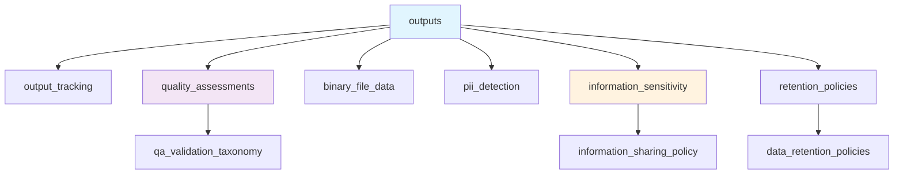
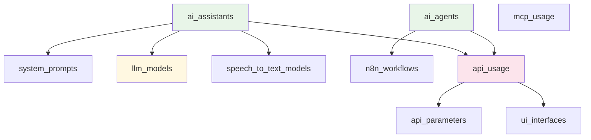
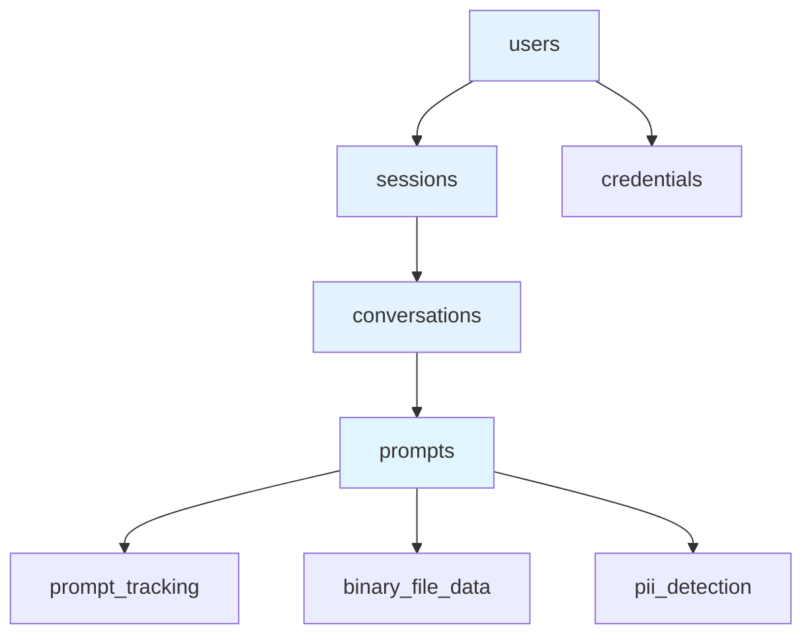
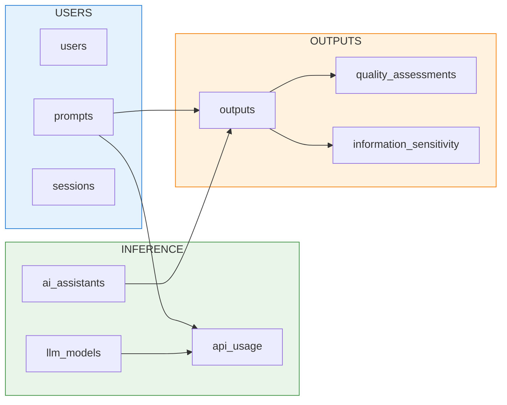

# AI Output Storage Backend - Data Models

A comprehensive data structure for storing and managing AI outputs, prompts, and related metadata in N8N workflows.

## 🏗️ Architecture Overview

The data model is organized into three primary domains:

### 1. **OUTPUTS Domain** 📤
Tables related to AI-generated content and their lifecycle management.

### 2. **INFERENCE Domain** 🤖  
Tables managing AI agents, assistants, models, and inference infrastructure.

### 3. **USERS Domain** 👥
Tables handling user interactions, prompts, sessions, and authentication.

---

## 📊 Data Model Diagrams

### **OUTPUTS Domain**


### **INFERENCE Domain**


### **USERS Domain**


### **Cross-Domain Relationships**


---

## 📁 Directory Structure

```
├── core-tables/           # Primary data storage
│   ├── prompts.csv
│   ├── outputs.csv
│   ├── conversations.csv
│   └── binary_file_data.csv
├── system-tables/         # AI system management
│   ├── ai_assistants.csv
│   ├── system_prompts.csv
│   ├── ai_agents.csv
│   ├── n8n_workflows.csv
│   ├── users.csv
│   ├── sessions.csv
│   └── credentials.csv
├── tracking-tables/       # Quality & task management
│   ├── output_tracking.csv
│   ├── prompt_tracking.csv
│   └── quality_assessments.csv
├── lookup-tables/         # Reference data
│   ├── llm_models.csv
│   ├── speech_to_text_models.csv
│   ├── ui_interfaces.csv
│   ├── api_parameters.csv
│   ├── qa_validation_taxonomy.csv
│   ├── retention_policies.csv
│   ├── data_retention_policies.csv
│   ├── api_usage.csv
│   └── mcp_usage.csv
├── security-tables/       # Security & compliance
│   ├── pii_detection.csv
│   ├── information_sensitivity.csv
│   └── information_sharing_policy.csv
└── docs/                  # Documentation
    └── data-model-overview.md
```

---

## 🔗 Key Relationships

### **Primary Data Flow**
1. **User** creates **Session** → **Conversation** → **Prompt**
2. **Prompt** processed by **AI Assistant** using **LLM Model**
3. **AI Assistant** generates **Output** 
4. **Output** undergoes **Quality Assessment** and **Tracking**

### **Relational Fields**

#### **Core Relationships**
- `prompts.conversation_id` → `conversations.id`
- `outputs.prompt_id` → `prompts.id`
- `outputs.assistant_id` → `ai_assistants.id`

#### **Security & Compliance**
- `pii_detection.prompt_id` → `prompts.id`
- `pii_detection.output_id` → `outputs.id`
- `information_sensitivity.id` → `data_retention_policies.sensitivity_level_id`

#### **Quality Management**
- `quality_assessments.output_id` → `outputs.id`
- `qa_validation_taxonomy.id` → `quality_assessments.criteria_id`

#### **Usage Tracking**
- `api_usage.prompt_id` → `prompts.id`
- `api_usage.output_id` → `outputs.id`
- `api_usage.assistant_id` → `ai_assistants.id`

---

## 🚀 N8N Integration Points

### **Webhook Endpoints**
- **Input Processing**: `POST /webhook/ai-prompt`
- **Output Storage**: `POST /webhook/ai-output`
- **Quality Review**: `POST /webhook/qa-review`

### **Workflow Triggers**
1. **Prompt Processing**: New prompt → AI inference → Output storage
2. **Quality Assessment**: New output → QA validation → Tracking update
3. **Retention Management**: Scheduled → Policy evaluation → Archive/Delete

### **Data Enrichment**
- **PII Detection**: Automated scanning on prompt/output creation
- **Sensitivity Classification**: Rule-based classification
- **Usage Tracking**: Real-time API call logging

---

## 📋 Implementation Notes

### **Data Types & Formats**
- **Timestamps**: UTC ISO 8601 format
- **JSON Fields**: Flexible configuration storage
- **Boolean Fields**: Multi-modal delivery tracking
- **Scores**: 0-10 scale for quality metrics

### **Security Features**
- **Encryption**: Binary files and sensitive data
- **PII Masking**: Automatic detection and masking
- **Access Control**: Role-based data access
- **Audit Trails**: Complete change tracking

### **Performance Considerations**
- **Indexing**: Primary keys, foreign keys, timestamps
- **Partitioning**: Large tables by date/user
- **Archival**: Automated based on retention policies
- **Cleanup**: Scheduled deletion of expired data

---

## 🔧 Getting Started

1. **Import CSV files** into your N8N database
2. **Configure workflows** using the provided webhook endpoints
3. **Set up retention policies** based on your requirements
4. **Enable PII detection** for compliance
5. **Configure quality assessment** workflows

For detailed implementation guidance, see [`docs/data-model-overview.md`](docs/data-model-overview.md).

---

## 📈 Monitoring & Analytics

The data model supports comprehensive analytics:
- **Usage Patterns**: API calls, model performance, user behavior
- **Quality Metrics**: Output quality trends, assessment scores
- **Cost Tracking**: Token usage, API costs per user/model
- **Compliance**: PII detection rates, retention policy adherence
